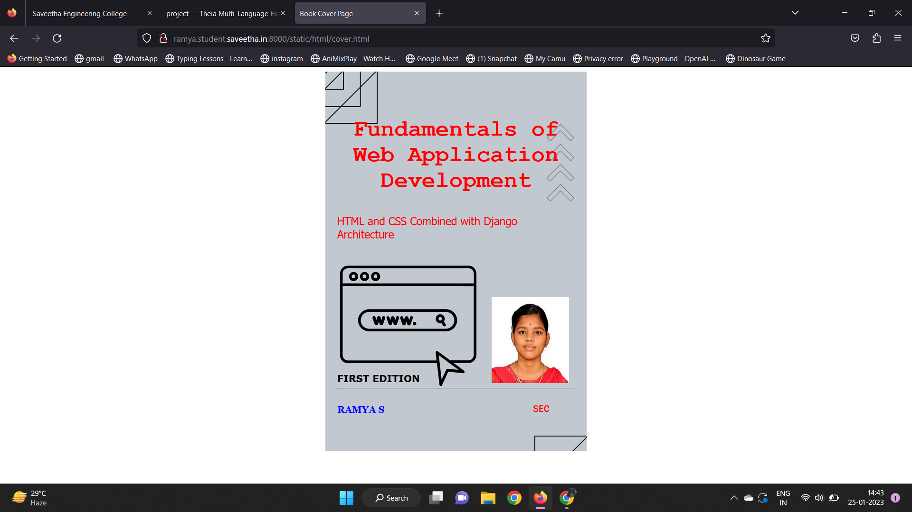
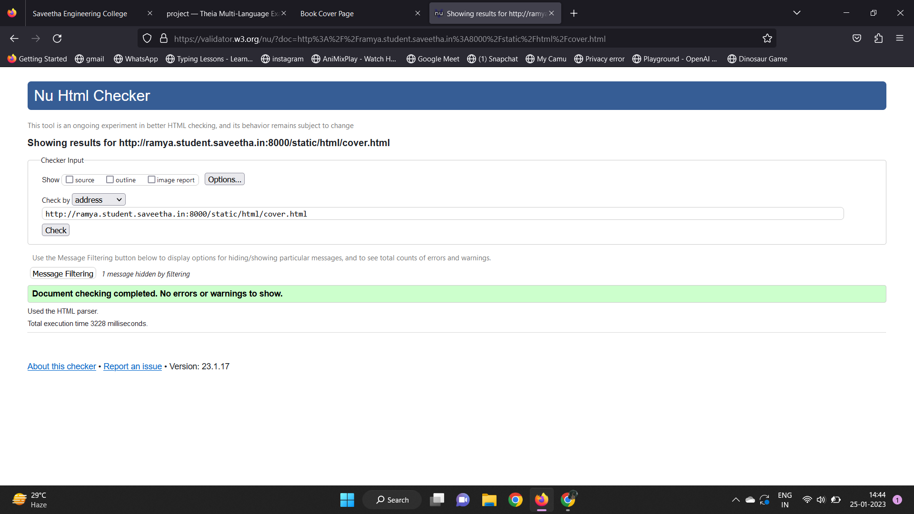

# cover-page-design
## AIM:
To develop a website to display the cover page design of a book

## Design Steps:

### Step 1:
 clone the Github repository and create a Django admin interface.

### Step 2:
 Write HTML and CSS code for designing book cover page and execute them.

## Code:
```
<!DOCTYPE html>
<html lang="en">
    <head>
         <meta name="viewport" 
         content="width=device-width, initial-scale=1.0">
         <style>

        .bookpage{
            width: 400px;
            height: 600px;
            color: red;
            margin-left: auto;
            margin-right: auto;
            padding: 20px;
            font-family: 'Franklin Gothic Medium', 'Arial Narrow', Arial, sans-serif;
            background-image: url(/static/images/back.png);
            background-size: cover;
        }
            

        .insight{
            color: blue;

        }

        
        .hrstyle{
            width:100px;
        }
        .author{
        
            display: inline;
            position: relative;
            color: blue;
            top:190px;
            
            font-family:Georgia;
            font-size: medium;
        }
        .booktitle{
            font-family: 'Courier New', Courier, monospace;
            font-size: larger;
            text-align: center;
            position: relative;
            top: 30px;
        
        }
        .id {
            width:400px;
            position: relative;
            top:180px;
            
        }
        .pub{
            font-size: medium;
            position: relative;
            top:155px;
            left:330px;
        }
        .ed{
            color: black;
            font-size: medium;
            font-family: Verdana;
            position:relative;
            top:85px;

        }
        .subtitle{
            font-family:Tahoma;
            font-size: large;
            position: relative;
            top:40px;
        }
        .mypic{
            position: relative;
            top: 135px;
            left: 260px;
            width: 100px;
            height: 100px;
            background-size: cover;
        }
        </style>
        <title>Book Cover Page</title>
    </head>
    <body>
        <div class="bookpage">
            <div class="insight">
                 
            </div>
            <div class="hrstyle">
                
            </div>
            <div class="booktitle">
                <h1>Fundamentals of Web Application Development</h1></div>
            <div class="subtitle">
                HTML and CSS Combined with Django Architecture
            </div>
            <div class="mypic">
                
            </div>
            <div class="id">
                <hr style="color: black;">
            </div>
            <div class="author">
               <p><b>KAVIYARASU</b></p>
            </div>
            <div class="pub">
                SEC
            </div>
            <div class="ed">
                <b>FIRST EDITION</b>
            </div>
        </div>
    </body>
</html>
```

## Output:


## HTML Validator


## Result:
 The Program for designing book cover page using HTML and CSS is executed successfully
